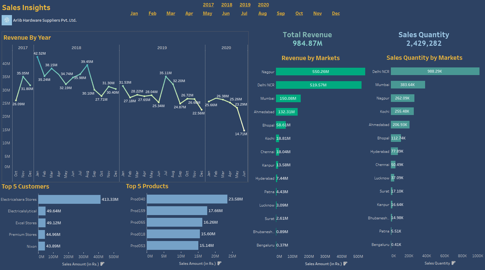

# Revenue-and-Sales-Analysis-in-Tableau

- [Revenue-and-Sales-Analysis-in-Tableau](#revenue-and-sales-analysis-in-tableau)
  * [Requirements](#requirements)
  * [Data used](#data-used)
  * [Exploring Data using MySQL](#exploring-data-using-mysql)
      - [Find total revenue for January, 2020](#find-total-revenue-for-january--2020)
      - [Show distrinct product codes that were sold in chennai](#show-distrinct-product-codes-that-were-sold-in-chennai)
  * [Data Visualization in Tableau](#data-visualization-in-tableau)
  * [Revenue Analysis](#revenue-analysis)
      - [Dark Theme:](#dark-theme-)
      - [Light Theme:](#light-theme-)
  * [Profit Analysis](#profit-analysis)


## Requirements
- MySQL Workbench (There are plenty of tutorials online for its installation)
- Tableau Desktop (You can use a 14 day trial version, or if you are a student like me, you can apply and get a student license for 1 year)

## Data used
You can import the data used for this tableau project in the sql dump file. In total there are 5 tables.
```
- PRODUCTS (product_code, product_type)
- CUSTOMERS (customer_code, customer_name, customer_type)
- MARKETS (market_code, market_name, zone)
- TRANSACTIONS (product_code, market_code, customer_code, order_date, 
  sales_qty, sales_amount, currency, profit_margin_percentage, profit_margin, cost_price)
- DATE (date, cy_date, year, month_name, date_yy_nmm)
```

Using the Data stored in the tables above, we are going to do a revenue and sales analysis. 


## Exploring Data using MySQL
You can perform SELECT operations on the tables to view the data. Additionally, you can use simple concepts like JOIN and GROUP by to find aggregate values across multiple tables as well.
Some of the commands i used are


#### Find total revenue for January, 2020
```sql
SELECT SUM(transactions.sales_amount) 
FROM transactions 
INNER JOIN date ON transactions.order_date=date.date 
WHERE date.year=2020 AND date.month_name="January" 
AND (transactions.currency="INR\r" OR transactions.currency="USD\r")`
```

#### Show distrinct product codes that were sold in chennai
```sql
SELECT distinct product_code FROM transactions where market_code='Mark001'
```


## Data Visualization in Tableau 

First, Connect Tableau Desktop to MySQL server. for this enter the required credentials (server name, port number, username, password etc).
Now, Select the 'Sales' database. Drag the 5 tables into the right pane. You will need to create relationships between these tables by selecting the appropriate columns.

I have created 3 dashboards (Revenue Analysis (in dark and light theme) and Profit Analysis). 

## Revenue Analysis
A Dashboard containing the following information was created to analyze the revenue of the imaginary company 'X Hardware Suppliers Pvt. Ltd.'
- Total Revenue
- Revenue Breakdown by year
- Revenue Breakdown by Market
- Total Sales Quantity
- Sales Breakdown by Market
- Top 5 Customers by Revenue
- Top 5 Products by Revenue
- Comparing BrickMortar v Ecommerce Revenue

2 Additional Worksheets were used to create Year and Month Filters.

#### Dark Theme: 


#### Light Theme:


## Profit Analysis
A Dashboard containing the following information was created to analyze the profit margins of the imaginary company 'X Hardware Suppliers Pvt. Ltd.'
- Revenue v Profit Margin % 
- Revenue Breakdown by Market
- Profit Breakdown by Market
- Profit Breakdown by Customers
- Profit Breakdown by Product

As with Revenue Analysis, 2 Additional Worksheets were used to create Year and Month Filters.


